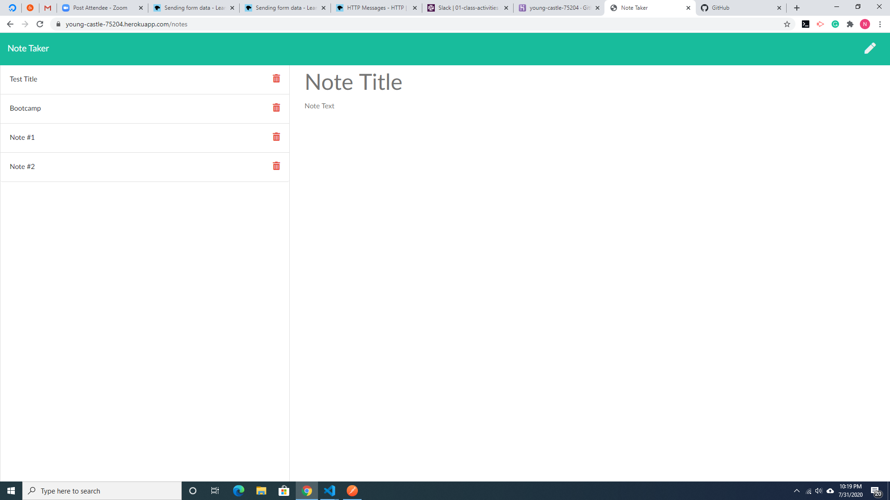

 
  
  # Note_taker
   
  https://young-castle-75204.herokuapp.com/
  url of a deployed application
  

  ## Description 
  
  It is an application that designed to to help to take notes, save them. and delete them.
  Helps to keep track of important tasks.
  This application use an express backend, it save and retrieve note data from a JSON file.
  

  ## Table of Contents  
  * [Installation](#installation)
  * [Usage](#usage)
  * [Contributors](#contibutors)
  * [License](#license)
  * [Test](#test)
  * [Questions](#questions)
  
  ## Installation 
  
  express

  ## Usage
  
  Open in a browser.Previously made notes will be displayed on the left.After you start entering the text of the new note , symbol "save" will appear in the top right corner.If you press trash can next to the exiting note, it will be deleted.Application using heroku server

  ## Contributors
  
  None

  ## Test
  
  None  

  ## License
  
  MIT

  ## Questions
  
  

  https://github.com/nata-stelmakh/Note_taker
  
  stelmakh.natallia@gmail.com
